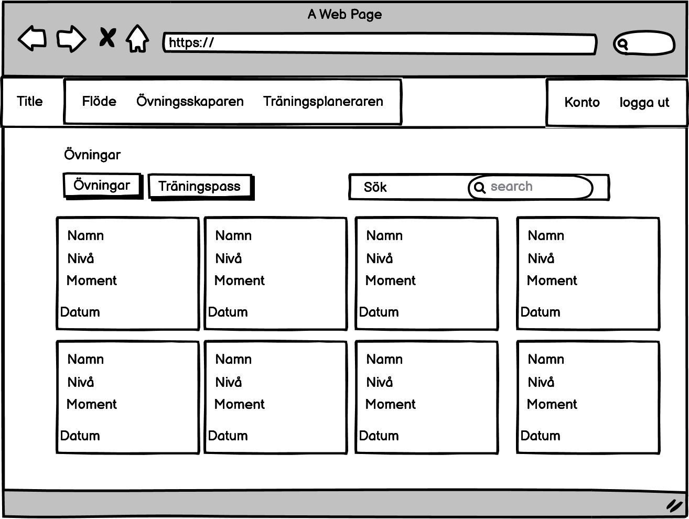

# Teknisk dokumentation

## Beskrivning

Syftet med detta projektet är att göra det lätt och smidigt och fotbollstränare att hitta och skapa övningar och träninspass. 

## Design

### Wireframes



### Färgschema


Projektet har försökt att hålla sig till SvFF blåa och gula färger, detta för att sidan ska kännas genuin eftersom att man oftast tänker sig de blågula färgerna när man tänker på fotboll.

### Typsnitt

Projektet använder sig av typsnitten "Exo2" för rubriker och underrubriker.

Det använder sig av roboto när det kommer till vanlig text. 

### Logotyp


## Fil och mappstruktur

Projektet är uppdelat i två olika mappar, den första är `server`, som innehåller en `express.js` server. Den Största anledningen till att jag har en server är för att hantera queries till och från databasen. Det skulle gått att göra det direkt på frontenden. Men det blir mer organiserat på detta sättet.

I `server` mappen är det två mappar och en fil som är viktiga:

| Fil/mapp  | Beskrivning                                                                                                                                                                |
| --------- | -------------------------------------------------------------------------------------------------------------------------------------------------------------------------- |
| `/public` | Innehåller publika bilder som används på sidan. `/public/images` innehåller tillexempel loggan och i undermappen `/drills` sparas bilderna som laddas upp från frontenden. |
| `/routes` | Innehåller `api.js`, vilket är apin som komminucerar med databasen och tar emot GET och POST request från fronendend                                                       |
| `app.js`  | `app.js` innehåller express-servern. Det är också där `node.js` moduler laddas in som används på hela severn.                                                              |

Den andra mappen som heter `client` innehåller ett `React.js` projekt. Som har skapats med `create-react-app` som är en del av `node.js`, det skapar en del boilerplate kod som är till för att skapa react-servern.

| Fil/mapp  | Beskrivning                                                                                                                                                                                                                               |
| --------- | ----------------------------------------------------------------------------------------------------------------------------------------------------------------------------------------------------------------------------------------- |
| `/public` | innehåller `index.html` vilket är filen som react renderar sina komponenter i.                                                                                                                                                            |
| `/src`    | Innehåller `App.jsx`, vilket är filen som kopplar ihop sidorna och komponenterna. Undermappen `/Components` innehåller alla komponenter som hemsidan använder sig av. `/static` innehåller css och javascriptfiler som hemsidan använder. |

## Frontend

Frontenden är uppbyggd med ett javascript-bibliotek som heter `React.js`.

`React` är egentligen till för att skapa så kallade "single-page" appar. Därför har jag använt mig av en extention till react som heter `react-router`, detta gör att man lätt kan skapa en layout, där enbart de komponenter som måste uppdateras gör det. Så tillexempel headern renderas bara om ifall någon element i den uppdateras. Detta Gör att dessa komponeneter inte laddar om även om man går till en annan sida. Vilken spara på laddningstid.

Förutom `react-router` har även följande react exstentions används:

- `useEffect`
  - För att uppdatera element när något uppdateras
- `useState`
  - För att spara information som ska skrivas ut på sidan, använder sig av `useEffect` för att uppdatera ändast när `useState` ändras.
- `useParams`
  - För att få tag i information från urlen, så som `/drill/id` så får man värdet på `id`

Sidan ska så lång det går använda sig av react-componenens när det kommer till element på sidan. Detta för att det då blir lättare att underhålla sidan med mindre kodändringar.

## Backend

Backend delen av projektet består av en `express.js` server. Den primära anledningen till att den finns till är för att hantera `MongoDB` databasen som projektet använder sig av. Den sekundära delen är för att hantera bilduppladdningar till servern, och sedan serva frontend delen med bilder. 

### Server

#### API

api.js filen ligger under `server/routes/api.js`, det är den filen som analyserar och hanterar datan som skickas från react.

#### API routes

##### POST request

| Route               | Action                     | Query (Request)               |
| ------------------- | -------------------------- | ----------------------------- |
| `/api/createuser`   | Skapar en ny användare     | User object                   |
| `/api/newdrill`     | Skapar en ny övning        | Drill object och bild         |
| `/api/deletedrill`  | Raderar en övning          | Drill id                      |
| `/api/updatedrill`  | Uppdaterar en övning       | Drill id                      |
| `/api/updatesesson` | Uppdaterar ett träninspass | Session id och Session object |

En post request kan se ut som följande:

```js
router.post("/route", function (req, res, next) {
  let data = req.body;
  // Dataprossessing
});
```

Ifall post requesten skulle behöva en bild ser den ut som följande:

```js
router.post("/route", upload("img"), function (req, res, next) {
  let data = req.body;
  // Data processing
});
```

Bilden kommer automatiskt att hanteras med hjälp av biblioteket `multer`.

##### GET request

| Route               | Action                                            | Query (Request)       | Response                          |
| ------------------- | ------------------------------------------------- | --------------------- | --------------------------------- |
| `/api/validateuser` | Söker efter användare i databasen                 | Username eller mail   | User object                       |
| `/api/signin`       | Söker efter användare för inlogg                  | Username och password | User object                       |
| `/api/getuser`      | Söker efter en användare                          | Username              | User object                       |
| `/api/userdrills`   | Söker efter övningar                              | Username              | Drill objects                     |
| `/api/getdrill`     | Söker efter en övning                             | Drill id              | Drill object                      |
| `/api/getdrills`    | Ger alla övningar i databasen                     |                       | Drill objects                     |
| `/api/newsession`   | Skapar en temporär databas modell för träninspass | Session object        | Session id                        |
| `/api/getsession`   | Söker efter träningspass                          | Session id            | Drill objects och Sesssion object |
| `/api/getsessions`  | Ger alla träninspass i databasen                  |                       | Session objects                   |

En GET request kan se ut som följande:

```js
router.get("/route", function (res, req, next) {
  let data = req.query;
  // Data processing
  res.send(output);
});
```

Där `req.query` är datan som skickas från frontend servern med hjälp av axios. ` /route` syftar på urlen som frontend server skickar sin förfrågan till. Exempelvis `http://localhost:3001/api/getuser`.

## Datalagring

Detta projektet använder sig av MongoDB som databas. MongoDb är en så kallad "no-sql" databas och använder sig av modeler via javascipt biblioteket `mongoose`.

Databasen består av tre modeller:

- User
- Drill
- Session

User-modellen sparar information om användaren.

En modell kan se ut som följnade:

```js
let SchemaName = new Schema({
  username: String,
  name: String,
  array: [],
  ...
});
```

### Bilder

Bilder lagras på servern i mappen `public/images/drills`.

## Testreslultat


Det låga "performance" beror först och främst på datorn, och för att projektet körs i "dev-mode"

## Kända problem

Säkerheten på sidan är dålig. Lösernordet sparas som ren text och username sparas i sessionStorage, detta gör det möjligt att ändra username i sessionStorage så har man tillgång till vilket konto som helst. 

Det går häller inte att ändra ordningen på övningarna i träningspassen, det går häller inte att lägga till och ta bort övningar ur ett träningspass.
